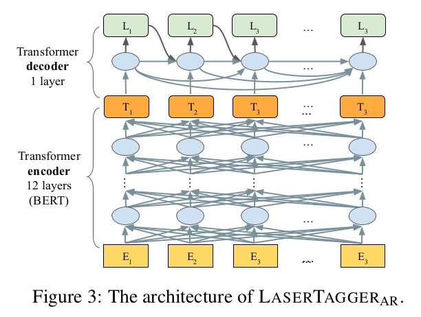

# LaserTagger
一．概述  
文本复述任务是指把一句/段文本A改写成文本B，要求文本B采用与文本A略有差异的表述方式来表达与之意思相近的文本。  
改进谷歌的LaserTagger模型，使用LCQMC等中文语料训练文本复述模型，即修改一段文本并保持原有语义。  
复述的结果可用于数据增强，文本泛化，从而增加特定场景的语料规模，提高模型泛化能力。  

二．模型介绍

谷歌在文献《Encode, Tag, Realize: High-Precision Text Editing》中采用序列标注的框架进行文本编辑，在文本拆分和自动摘要任务上取得了最佳效果。  
在同样采用BERT作为编码器的条件下，本方法相比于Seq2Seq的方法具有更高的可靠度，更快的训练和推理效率，且在语料规模较小的情况下优势更明显。  

谷歌公开了本文献对应的代码，但是原有任务与当前任务有一定的差异性，需要修改部分代码，主要修改如下：  
A.分词方式：原代码针对英文，以空格为间隔分成若干词。现在针对中文，分成若干字。  
B.推理效率：原代码每次只对一个文本进行复述，改成每次对batch_size个文本进行复述，推理效率提高6倍。  

三.文件说明和实验步骤  
1.安装python模块
参见"requirements.txt", "rephrase.sh"
2.训练和评测模型  
文件需求 
    bert预训练的tensorflow 模型

代码跑通顺序：
第一种方法：
    修改运行rephrase.sh
第二种方法详解：
    第一步：制作训练测试验证集
        python get_pairs_chinese/get_text_pair_lcqmc.py 获得lcqmc中的文本复述语料(语义一致的文本对，且字面表述差异不能过大，第三列为最长公共子串长度与总长度的比值)  
        只需要修改lcqmc的目录位置即可  
        python get_pairs_chinese/get_text_pair.py 可根据自己的预料获得文本复述语料(第三列为最长公共子串长度与总长度的比值)  
        再运行merge_split_corpus.py 将 结果数据 按比例划分 训练、测试、验证集  
    第二步：短语_词汇表_优化
        python phrase_vocabulary_optimization.py \
        --input_file=./data/train.txt \
        --input_format=wikisplit \
        --vocabulary_size=500 \
        --max_input_examples=1000000  \
        --enable_swap_tag=false \
        --output_file=./output/label_map.txt  
    第三步：  
        1、制作后续训练模型的验证集  
        python preprocess_main.py \
        --input_file=./data/tune.txt \
        --input_format=wikisplit \
        --output_tfrecord=./output/tune.tf_record \
        --label_map_file=./output/label_map.txt \
        --vocab_file=./data/RoBERTa-tiny-clue/vocab.txt \
        --max_seq_length=40  \
        --output_arbitrary_targets_for_infeasible_examples=false
        2、制作后续训练模型的训练集  
        python preprocess_main.py \
        --input_file=./data/train.txt \
        --input_format=wikisplit \
        --output_tfrecord=./output/train.tf_record \
        --label_map_file=./output/label_map.txt \
        --vocab_file=./data/RoBERTa-tiny-clue/vocab.txt \
        --max_seq_length=40  \
        --output_arbitrary_targets_for_infeasible_examples=false  
    第四步：  
        1、训练模型  
        python run_lasertagger.py \
        --training_file=./output/train.tf_record \
        --eval_file=./output/tune.tf_record \
        --label_map_file=./output/label_map.txt \
        --model_config_file=./configs/lasertagger_config.json \
        --output_dir=./output/models/wikisplit_experiment_name  \
        --init_checkpoint=./data/RoBERTa-tiny-clue/bert_model.ckpt \
        --do_train=true  \
        --do_eval=true \
        --train_batch_size=256 \
        --save_checkpoints_steps=200 \
        --max_seq_length=40 \
        --num_train_examples=319200 \
        --num_eval_examples=5000  
        2、 模型整理  
        python run_lasertagger.py \
        --label_map_file=./output/label_map.txt \
        --model_config_file=./configs/lasertagger_config.json \
        --output_dir=./output/models/wikisplit_experiment_name \
        --do_export=true \
        --export_path=./output/models/wikisplit_experiment_name  
    第五步 根据test文件进行预测  
        python predict_main.py \
        --input_file=./data/test.txt \
        --input_format=wikisplit \
        --output_file=./output/models/wikisplit_experiment_name/pred.tsv \
        --label_map_file=./output/label_map.txt  \
        --vocab_file=./data/RoBERTa-tiny-clue/vocab.txt \
        --max_seq_length=40 \
        --saved_model=./output/models/wikisplit_experiment_name/1587693553  
        # 解析，这应该是最后保存的模型文件名称 可以考如下语句获得     
        # (ls "./output/models/wikisplit_experiment_name/" | grep -v "temp-" | sort -r | head -1)
    第六步 对第五步预测的文件进行打分。  
        python score_main.py --prediction_file=./output/models/wikisplit_experiment_name/pred.tsv  

#根据自己情况修改脚本"rephrase.sh"中2个文件夹的路径，然后运行  sh rephrase.sh  
#脚本中的变量HOST_NAME是作者为了方便设定路径使用的，请根据自己情况修改；  
#如果只是离线的对文本进行批量的泛化，可以注释脚本中其他部分，只用predict_main.py就可以满足需求。  
3.启动文本复述服务  根据自己需要，可选  
根据自己情况修改"rephrase_server.sh"文件中几个文件夹的路径，使用命令"sh rephrase_server.sh"可以启动一个文本复述的API服务  
本API服务可以接收一个http的POST请求，解析并对其中的文本进行泛化，具体接口请看“rephrase_server/rephrase_server_flask.py"  
有几个脚本文件如rephrase_for_qa.sh，rephrase_for_chat.sh，rephrase_for_skill.sh是作者自己办公需要的，可以忽略  

四．实验效果  
1. 在公开数据集Wiki Split上复现模型：  
Wiki Split数据集是英文语料，训练模型将一句话拆分成两句话，并保持语义一致，语法合理，语义连贯通顺，如下图所示。  

Exact　score=15,SARI score=61.5,KEEP score=93,ADDITION score=32,DELETION score=59,  
基本与论文中的Exact score=15.2；SARI score=61.7一致（这些分数均为越高越好）。  
2. 在自己构造的中文数据集训练文本复述模型：  
（1）语料来源  
（A）一部分语料来自于LCQMC语料中的正例，即语义接近的一对文本；  
（B）另一部分语料来自于宝安机场用户QA下面同一答案的问题。; 
因为模型的原理，要求文本A和B在具有一定的重合字数，故过滤掉上述两个来源中字面表述差异大的文本，如“我要去厕所”与“卫生间在哪里”。对语料筛选后对模型进行训练和测试。  
（2）测试结果：  
对25918对文本进行复述和自动化评估，评测分数如下（越高越好）：  
Exact score=29,SARI score=64,KEEP score=84,ADDITION score=39,DELETION score=66.  
CPU上耗时0.5小时，平均复述一句话需要0.72秒。  
可能是语言和任务不同，在中文文本复述上的评测分数比公开数据集高一些。  

五.一些trick  
1.可以设定对于某些字或词不做修改
如对实体识别NER的语料泛化，需要保证模型不能修改其中的实体；  
对业务语料泛化，也可以根据情况保证模型不能修改其中的关键字 如日期，航班号等；  
目前，是通过正则的方式定位这些不能被模型修改的位置，然后将这些位置的location设置为1，具体实现参见tagging.py.  
2.增加复述文本与原文本的差异度  
可以对训练语料中的text_a先进行随机的swag操作，相应地脚本中enable_swap_tag改为true，再训练模型将其改写为text_b;  
实际应用或测试时同样将原始文本text_a先进行随机的swag操作，然后利用模型改写为text_b;  
因为训练语料中text_a是不通顺，但text_b是通顺的，所以实际应用或测试时仍然会得到通顺的复述结果。  

六.数据集  
1.由于不少人咨询我数据集的问题，现将数据集地址贴在下面  
You can download LCQMC data set from https://download.csdn.net/download/tcd1112/12357994,But other data is the company data can't give you.
You can also leave your E-mail, I will send you LCQMC data  

七.文件 tree树如下：  
文件框架格局如下：  
	├── chat_rephrase  
	│   ├── __init__.py  
	│   ├── predict_for_chat.py  
	│   └── score_for_qa.txt  
	├── configs  
	│   ├── lasertagger_config_base.json  
	│   └── lasertagger_config.json  
	├── data  
	│   ├── LCQMC  
	│   │   ├── dev.txt  
	│   │   ├── test.txt  
	│   │   └── train.txt  
	│   ├── lcqmc.txt  
	│   ├── QQ  
	│   │   └── Q_Q.txt  
	│   ├── QQ.txt  
	│   ├── RoBERTa-tiny-clue  
	│   │   ├── bert_config.json  
	│   │   ├── bert_model.ckpt.data-00000-of-00001  
	│   │   ├── bert_model.ckpt.index  
	│   │   ├── bert_model.ckpt.meta  
	│   │   ├── checkpoint  
	│   │   └── vocab.txt  
	│   ├── test.txt  
	│   ├── train.txt  
	│   └── tune.txt  
	├── domain_rephrase  
	│   ├── __init__.py  
	│   ├── predict_for_domain.py  
	│   └── rephrase_for_domain.sh  
	├── get_pairs_chinese  
	│   ├── curLine_file.py  
	│   ├── get_text_pair_lcqmc.py  
	│   ├── get_text_pair.py  
	│   ├── get_text_pair_sv.py  
	│   ├── __init__.py  
	│   ├── merge_split_corpus.py  
	├── official_transformer  
	│   ├── attention_layer.py  
	│   ├── beam_search.py  
	│   ├── embedding_layer.py  
	│   ├── ffn_layer.py  
	│   ├── __init__.py  
	│   ├── model_params.py  
	│   ├── model_utils.py  
	│   ├── tpu.py  
	│   └── transformer.py  
	├── output  
	│   ├── label_map.txt  
	│   ├── label_map.txt.log  
	│   ├── models  
	│   │   └── wikisplit_experiment_name  
	│   │       ├── 1587693553  
	│   │       │   ├── saved_model.pb  
	│   │       │   └── variables  
	│   │       │       ├── variables.data-00000-of-00001  
	│   │       │       └── variables.index  
	│   │       ├── checkpoint  
	│   │       ├── events.out.tfevents.1587638931.tcd-All-Series  
	│   │       ├── graph.pbtxt  
	│   │       ├── model.ckpt-3643.data-00000-of-00001  
	│   │       ├── model.ckpt-3643.index  
	│   │       ├── model.ckpt-3643.meta  
	│   │       └── pred.tsv  
	│   ├── train.tf_record  
	│   ├── train.tf_record.num_examples.txt  
	│   ├── tune.tf_record  
	│   └── tune.tf_record.num_examples.txt  
	├── qa_rephrase  
	│   ├── __init__.py  
	│   └── predict_for_qa.py  
	├── rephrase_server  
	│   ├── __init__.py  
	│   ├── rephrase_server_flask.py  
	│   └── test_server.py  
	├── skill_rephrase  
	│   ├── __init__.py  
	│   └── predict_for_skill.py  
	├── __init__.py  
	├── AR_architecture.png  
	├── bert_example.py  
	├── bert_example_test.py  
	├── compute_lcs.py  
	├── config.json  
	├── CONTRIBUTING.md  
	├── curLine_file.py  
	├── LICENSE  
	├── phrase_vocabulary_optimization1.py  
	├── phrase_vocabulary_optimizationdada.py  
	├── phrase_vocabulary_optimization_test.py  
	├── prediction.txt  
	├── predict_main.py  
	├── predict_utils.py  
	├── predict_utils_test.py  
	├── preprocess_main.py  
	├── README.md  
	├── rephrase_for_chat.sh  
	├── rephrase_for_qa.sh  
	├── rephrase_for_skill.sh  
	├── rephrase_server.sh  
	├── rephrase.sh  
	├── requirements.txt  
	├── run_lasertagger.py  
	├── run_lasertagger_test.py  
	├── run_lasertagger_utils.py  
	├── run_lasertagger_utils_test.py  
	├── sari_hook.py  
	├── score_lib.py  
	├── score_lib_test.py  
	├── score_main.py  
	├── sentence_fusion_task.png  
	├── tagging_converter.py  
	├── tagging_converter_test.py  
	├── tagging.py  
	├── tagging_test.py  
	├── train.txt  
	├── transformer_decoder.py  
	├── tune.txt  
	├── utils.py  
	└── utils_test.py  

